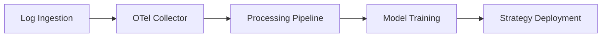

# System Architecture

## Data Flow

The platform processes information from log ingestion through to live strategy deployment.

1. **Log Ingestion** captures trade and system events.
2. The **OTel Collector** normalises and forwards telemetry.
3. The **Processing Pipeline** enriches data and prepares features.
4. **Model Training** produces strategies based on the processed data.
5. **Strategy Deployment** pushes trained models to execution services.

This flow ensures that incoming logs ultimately influence the models executing in production.

