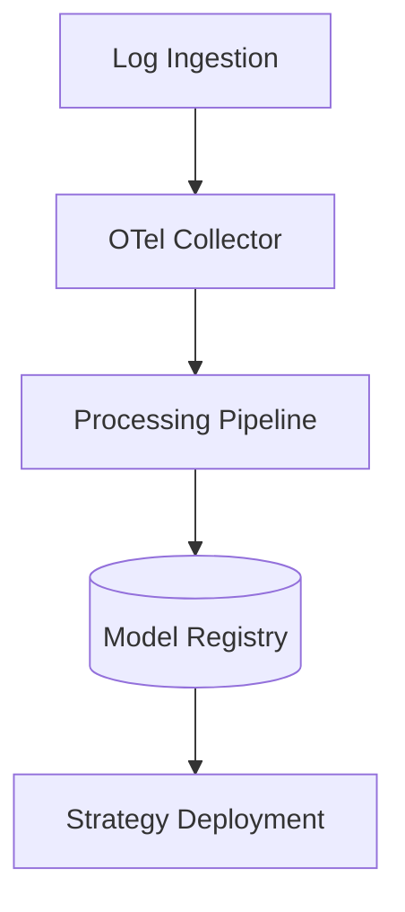
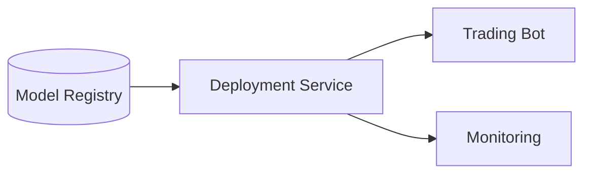

# System Architecture

The system consists of modular components for ingesting data, training models and deploying strategies.

## Deployment Topology

See the [Data Flow](data_flow.md) page for a step-by-step walkthrough from ingestion to deployment.
