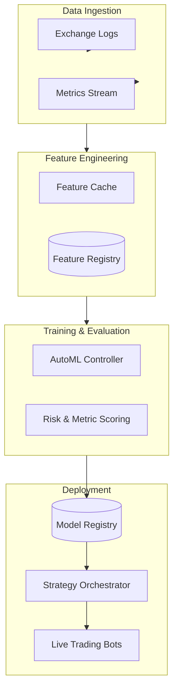
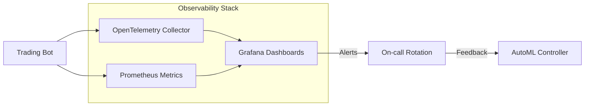
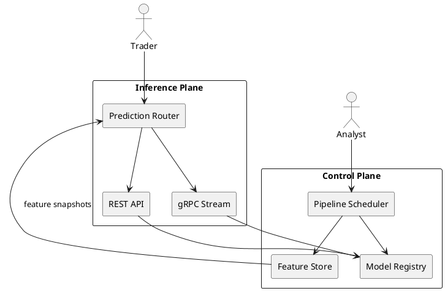

# System Architecture

BotCopier is organised as a set of cooperating services that ingest market
data, produce enriched features, train candidate models, and finally deploy the
most promising strategy. The following diagrams provide both high-level and
operational views using Mermaid and PlantUML so the topology can be explored in
multiple notations.

## High-level Pipeline (Mermaid)

## Observability and Feedback Loops (Mermaid)

These feedback loops ensure that human operators can intervene quickly if a
strategy drifts away from acceptable behaviour. The [Data Flow](data_flow.md)
page provides an even more detailed walkthrough from ingestion to deployment.

## Deployment Topology (PlantUML)

This diagram highlights the control plane components that coordinate model
lifecycle management separately from the low-latency inference services. The
PlantUML and Mermaid variants use the same naming so teams familiar with either
notation can collaborate without friction.
