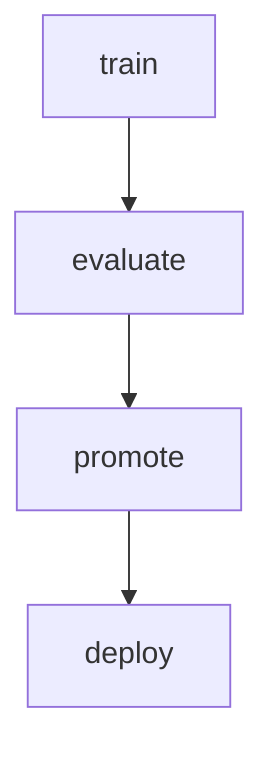

# CLI Usage

The project exposes a unified command line interface built with [Typer](https://typer.tiangolo.com/).

Run ``botcopier --help`` to list available commands. Key subcommands include:

- ``train`` – train a model from logs.
- ``evaluate`` – compare predictions against realised trades.
- ``online-train`` – update a model continuously from streaming data.
- ``drift-monitor`` – monitor feature drift against a baseline.

## API

::: botcopier.cli
