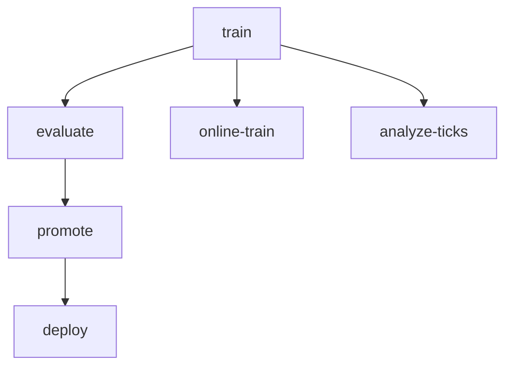

# CLI Usage

The project exposes a unified command line interface built with [Typer](https://typer.tiangolo.com/).



Run ``botcopier --help`` to list available commands. Key subcommands include:

- ``train`` – train a model from logs.
- ``evaluate`` – compare predictions against realised trades.
- ``online-train`` – update a model continuously from streaming data.
- ``drift-monitor`` – monitor feature drift against a baseline.
- ``serve-model`` – launch the FastAPI prediction service with Prometheus
  instrumentation.
- ``flight-server`` – expose Arrow Flight endpoints for streaming trade and
  metric batches.
- ``analyze-ticks`` – compute summary metrics and volatility for exported tick
  history files.

## Feature plugins

Features can be enabled individually when training. Use ``--feature`` repeatedly
to specify plugin names:

```bash
botcopier train /path/to/logs /path/to/out --feature technical --feature custom
```

The same list may be supplied in a config file under ``training.features``.

## API

::: botcopier.cli
