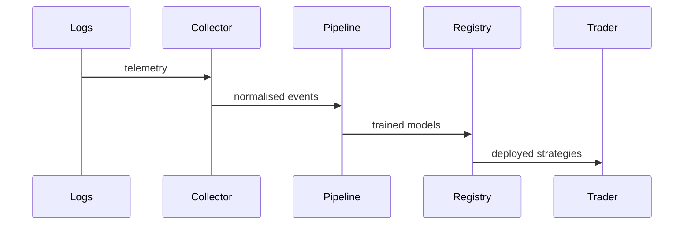

# Data Flow

The platform streams telemetry from ingestion to live trading.

## Sequence Diagram

1. **Logs** are captured from trading and system events.
2. The **Collector** normalises telemetry into a common schema.
3. The **Pipeline** enriches data and trains candidate models.
4. Models and metadata are stored in the **Registry**.
5. The **Trader** loads promoted models for execution.

See the [Model Registry](model_registry.md) page for details on storing and retrieving models.
