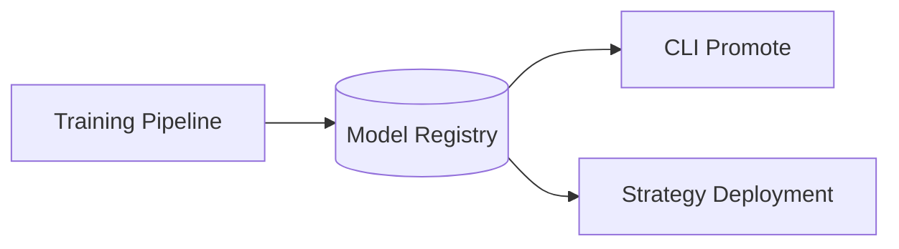

# Model Registry

The registry stores trained models along with metadata and provides utilities for loading and upgrading them.

## Registry Diagram

Models are recorded with a version and optional migrations to keep them compatible across releases. Builders are registered under a simple name and retrieved at runtime.

## API

::: botcopier.models.registry
