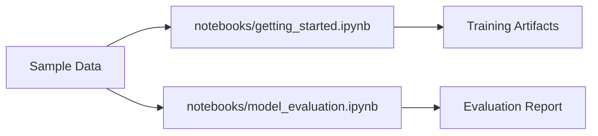

# Example Notebooks

The ``notebooks`` directory contains self-contained walkthroughs that mirror the
``Getting Started`` guide in an executable format. Each notebook loads the
sample CSV files stored under ``notebooks/data`` and drives the Typer-based CLI
through Python helper functions.

## Available notebooks

- ``getting_started.ipynb`` – creates a temporary workspace, runs
  ``botcopier train`` against the bundled logs, and inspects the generated
  metrics and model card.
- ``model_evaluation.ipynb`` – demonstrates how to call ``botcopier
  evaluate`` with example predictions and render a concise metrics summary.

Both notebooks are designed to run on a vanilla Python installation without
special hardware. They rely exclusively on the files in ``notebooks/data`` so
that you can experiment offline.

## Using the notebooks with nbstripout

The project integrates the ``nbstripout`` pre-commit hook to keep outputs out of
version control. When you save a notebook, run ``pre-commit run nbstripout``
locally (or ``pre-commit run --all-files``) to normalise the metadata before
pushing your branch. The CI pipeline enforces the same check.

## Running notebooks as tests

For quick smoke tests you can execute the notebooks with ``papermill`` or
``jupyter nbconvert --execute``. Since the samples are tiny, the end-to-end run
completes in seconds and exercises both the CLI and the evaluation pipeline.
